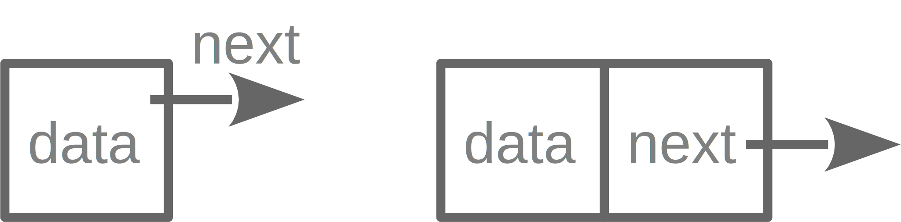
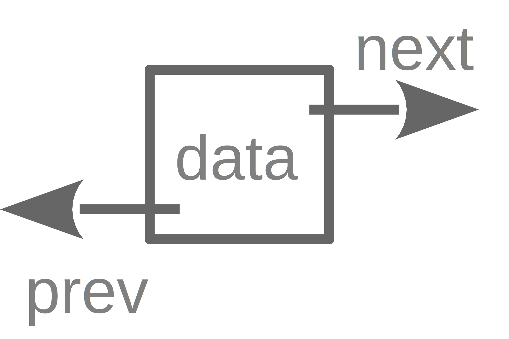

class: center, middle


# Dynamic Memory Allocation and Linked List


#### Yueh-Hua Tu


#### 2020.11.6


---


# Memory allocation


When memory is required to store values, memory allocation happens...


--


### Static memory allocation


Allocate memory before runtime (e.g. compile time).


--


#### Example


```c
int a;
float b = 2.3;
int *ptr;
int arr[10];
```


---


# Memory allocation


### Dynamic memory allocation


Allocate memory in runtime.


--


  * `malloc()`: memory allocation, dynamically allocates single large contiguous block of memory.
  * `calloc()`: contiguous allocation, dynamically allocates multiple contiguous blocks of memory.
  * `free()`: de-allocation or release memory
  * `realloc()`: re-allocation, dynamically changes the memory previously allocated.


--


#### Example


```c
ptr = (int*) malloc(100 * sizeof(int));
// do something...
free(ptr);
```


> [Dynamic Memory Allocation in C](https://www.geeksforgeeks.org/dynamic-memory-allocation-in-c-using-malloc-calloc-free-and-realloc/)


---


# Pitfalls of pointers


### Wild pointer


Uninitialized pointer, address which pointer point to is undefined.


```c
int *ptr;
```


--


### Dangling pointer


A pointer which points to illegal memory trunk.


```c
int *ptr = (int *) malloc(sizeof(int));
free(ptr);

int i = 3;
*ptr = &i;
```


---


# Pitfalls of pointers


### Memory leakage


Don't release memory after using memory.


---


# Memory allocation in process


> [Processes](https://notes.shichao.io/tlpi/ch6/)


---


# Memory allocation of array


--


### Allocates array in compile time


```c
int arr[10];  // in stack
```


--


### Allocates array in runtime


```c
int *ptr = (int*) malloc(10 * sizeof(int));  // in heap
```


---


# Speed in register, cache and memory


> [你所不知道的 C 語言：記憶體管理、對齊及硬體特性](https://hackmd.io/@sysprog/c-memory?type=view)


---


# Memory allocation for struct


```c
typedef struct {
    char name[20];
    unsigned age;
} person;

person p = {"Peter", 35};
```


--


### Point type in struct


```c
typedef struct {
    double x;
    double y;
} point;

point *pt = malloc(sizeof(point));
```


---


# struct as a node


--


### Self-referencing


```c
typedef struct {
    int data;
    Node * next;
} Node;
```


--





> [如何建構Linked List](https://medium.com/@MyCollegeNotebook/%E5%A6%82%E4%BD%95%E5%BB%BA%E6%A7%8Blinked-list-4f49604e044a)


---


# Linked list





--


--


---


# Linked list


```c
Node *insert(Node * ptr, int pos, int value);
```


--


```c
Node *delete(Node * ptr, int pos);
```


---


# Advanced


  * [What a C programmer should know about memory](https://marek.vavrusa.com/memory/)


---


# Homework


Implement linked list in C.


  * Complete data structure for node and optional linked list.
  * Implement `insert`, `delete` and `length` function for linked list.


### API reference


```c
Node *insert(Node * ptr, int pos, int value);
Node *delete(Node * ptr, int pos);
int length(Node * ptr);
```

